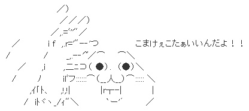

#JavaScriptあんまり使ったことのないやつが送るJavasciript

#スクロール量に応じた動きを実装する。

　


##HTMLファイルの準備
1.以下の名称でファイルを任意のフォルダ配下に作成する。

*demo.html*

2.demo.htmlをテキストエディタで開き、以下をコピペする。
```html
<!DOCTYPE html PUBLIC "-//W3C//DTD XHTML 1.0
<html lang="ja">
<head>
	<meta http-equiv="Content-Type" content="text/html; charset=UTF-8" />
	<meta http-equiv="Content-Style-Type" content="text/css" />
	<meta http-equiv="Content-Script-Type" content="text/javascript" />
	<title>DEMO</title>
	
	<!-- CSS -->
	<style type="text/css">
		
	</style>
</head>

<body>
	<!-- HTML -->
	<h1>TERU'S HACK SPACE</h1>
		
		<div class="nav">
			<ul class="clearfix">
				<li><a href="#">HOME</a></li>
				<li><a href="#">ABOUT</a></li>
				<li><a href="#">NEWS</a></li>
				<li><a href="#">LINK</a></li>
			</ul>
		</div><!-- /#nav -->
		
		<div id="article">
			<h2>SAMPLE </h2>
			<p>
			This is sample page<br />
			use jQuery<br />
			</p>
		</div>
</body>

<!-- JaavScript -->
<script>
</script>


</html>
```

※今回はハンズオン中のミス防止のためスタイルシート等の分離はしません。

3.編集が完了したら保存してブラウザで表示してみましょう。以下のように表示されていればOKです！

[リンクはこちら](demo/demo-11.html)


##css追記 --- bodyに対するcss ---

1.css部分に以下を追記する。

*追記部分*
```css
		body {
			background: #fffaf0;
			color: #333333;
			font: 16px/1.7 Arial, Helvetica, sans-serif;
			}
```

2.編集が完了したら保存してブラウザで表示してみましょう。以下のように表示されていればOKです！

[リンクはこちら](demo/demo-12.html)


##css追記 --- h1、h2、clearfixのcss ---
1.css部分に以下を追記する。

*追記部分*
```css
		h1 {
			font-size: 200%;
			text-align: center;
			padding: 20px;
		}
		h1 a {
			color: #444;
			text-decoration: none;
		}
		h1 a:hover {
			color: #888;
			text-decoration: underline;
		}
		h2 {
			font-size: 200%;
			margin-bottom: 0.5em;
		}
		p {
			margin-bottom: 1em;
		}
		.clearfix:before,
		.clearfix:after {
	    	content:"";
    		display:table;
		}
		.clearfix:after {
    		clear:both;
		}
		.clearfix {
    		zoom:1;
		}
```

2.編集が完了したら保存してブラウザで表示してみましょう。以下のように表示されていればOKです！

[リンクはこちら](demo/demo-13.html)

補足：


| css | 説明 | 
|: - :|: -- :| 
| .clearfix | フロートした要素が親要素からはみだしを回避する。 |


##css追記 --- id指定部分に対するCSS ---
1.css部分に以下を追記する。

*追記部分*
```css
		/* ======================================== */
		#article {
			background: #fff;
			padding: 60px;
			height: 2000px;
			margin: 0 auto 60px;
			width: 680px;
		}
		#page-top {
			text-align: right;
			margin-top: 20px;
		}
		#page-top a {
			color:#666;
			text-decoration: none;
		}
		#page-top a:hover {
			text-decoration: underline;
		}
		
```


2.編集が完了したら保存してブラウザで表示してみましょう。以下のように表示されていればOKです！

[リンクはこちら](demo/demo-14.html)


##css追記 --- navi部分に対するCSS ---
1.css部分に以下を追記する。

*追記部分*
```css

		/* ======================================== */
		.nav {
			padding: 0 20px;
			margin: 0 auto 60px;
			width: 760px;
			font-size: 85%;
			border-radius: 5px;
			-webkit-border-radius: 5px;
			-moz-border-radius: 5px;
			background: #555;
			background: -moz-linear-gradient(top, #666, #333);
			background: -webkit-gradient(linear, left top, left bottom, from(#666), to(#333));
			background: -o-linear-gradient(top, #666, #333);
		}
		.nav li {
			list-style: none;
			float: left;
		}
		.nav li a {
			text-decoration: none;
			color: #fff;
			padding: 8px 12px;
			display: block;
		}
		.nav li a:hover {
			background: #666;
		}
		.fixed {
			position: fixed;
			top: 0;
			left: 0;
			width: 100%;
			border-radius: 0;
			-webkit-border-radius: 0;
			-moz-border-radius: 0;
			-o-border-radius: 0;
			-webkit-box-shadow: 0px 3px 5px 0px rgba(0,0,0,0.3);
			-moz-box-shadow: 0px 3px 5px 0px rgba(0,0,0,0.3);
			box-shadow: 0px 3px 5px 0px rgba(0,0,0,0.3);
		}
```

2.編集が完了したら保存してブラウザで表示してみましょう。以下のように表示されていればOKです！

[リンクはこちら](demo/demo-15.html)


ここまでJSの話なし！



[NEXT](Javascript-12.html)


