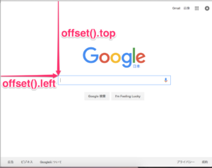

#JavaScriptあんまり使ったことのないやつが送るJavasciript

#スクロール量に応じた動きを実装する。

##jQueryとは
Javascriptのライブラリです。

##jQueryの準備

1.以下のページにアクセス

http://jquery.com/download/

2.「Download the compressed, production jQuery 3.3.1」をDL。

3.DLできなかった場合は「Download the uncompressed, development jQuery 3.3.1」の方をクリック。
表示された内容を全て選択し、コピー。demo.htmlと同一のディレクトリに「jquery-1.11.3.min.js」という名称で保存してください。


## js追記 -- ---
1.script部分に以下を追記する。

```Javascript
$(function() {
	var nav = $('.nav');
	var navTop = nav.offset().top;
	$(window).scroll(function () {
		var winTop = $(this).scrollTop();
		if (winTop >= navTop) {
			nav.addClass('fixed')
		} else if (winTop <= navTop) {
			nav.removeClass('fixed')
		}
	});
});
```

以下のポイントを押さえましょう。

+ 変化をつけるのはnav

+ 変化する契機をスクロール量でどう表現するか。

上記踏まえ、まず以下でnavを変数定義します。

```javascript
var nav = $('.nav');
```
次に以下でnavの縦座標を変数定義してます。
offset().topはjQueryから呼び出しており、top値を取得してきます。すなわちここでページトップの座標が取得されます。


```Javascript
var navTop = nav.offset().top;
```





次に、この動作の関数部分についてです。

>scrollは各要素のscrollイベントに関数をbindします。
>scrollイベントは、文書がスクロールした際に呼び出されます。
>jQueryのイベントは、コールバック関数の最初の引数でjQuery.Eventオブジェクトを受け取ることができます。このオブジェクトを使って、規定のイベント動作のキャンセルや、バブリングの抑制などを行います。

すなわち、画面をスクロールすることで以下の内容が逐次適用されているわけです。
```Javascript
		
		var winTop = $(this).scrollTop();
		if (winTop >= navTop) {
			nav.addClass('fixed')
		} else if (winTop <= navTop) {
			nav.removeClass('fixed')
		}
```
上記ではwinTopを定義し、winTopと事前定義したnavTopの差分を比較しています。
そして、(winTop >= navTop)の条件に対して以下をうわがいているわけです。


```Javascript
fixed {
			position: fixed;
			top: 0;
			left: 0;
			width: 100%;
			border-radius: 0;
			-webkit-border-radius: 0;
			-moz-border-radius: 0;
			-o-border-radius: 0;
			-webkit-box-shadow: 0px 3px 5px 0px rgba(0,0,0,0.3);
			-moz-box-shadow: 0px 3px 5px 0px rgba(0,0,0,0.3);
			box-shadow: 0px 3px 5px 0px rgba(0,0,0,0.3);
		}
```

fixedが適用されると、「Pposition: fixed」が効いてきます。
また、top0、left0、width100%にすることにより、画面上部に固定されたnav領域が出現するのです。
 
「border-radius」以下に記述されている内容は各ベンダープレフィクスと呼び、
それぞれのブラウザでのCSS解析を補助している。

| 項目  | 説明 |
| :---: |:---: |
| webkit | Chrome iso |
| moz | Mozilla  |
| o | Opera | 
| ms | IE | 


[NEXT](Javascript-12.html)
[PREVIOUS](Javascript-11.html)